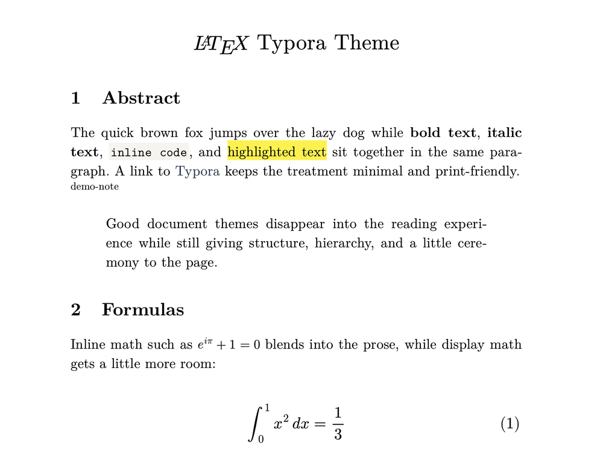
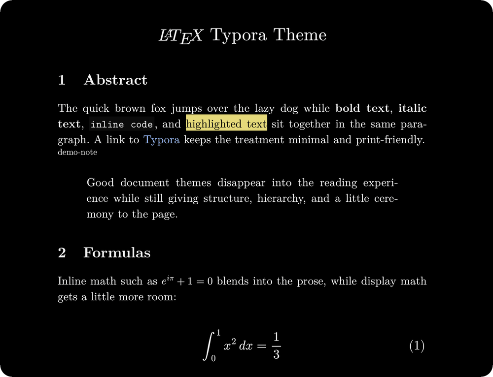
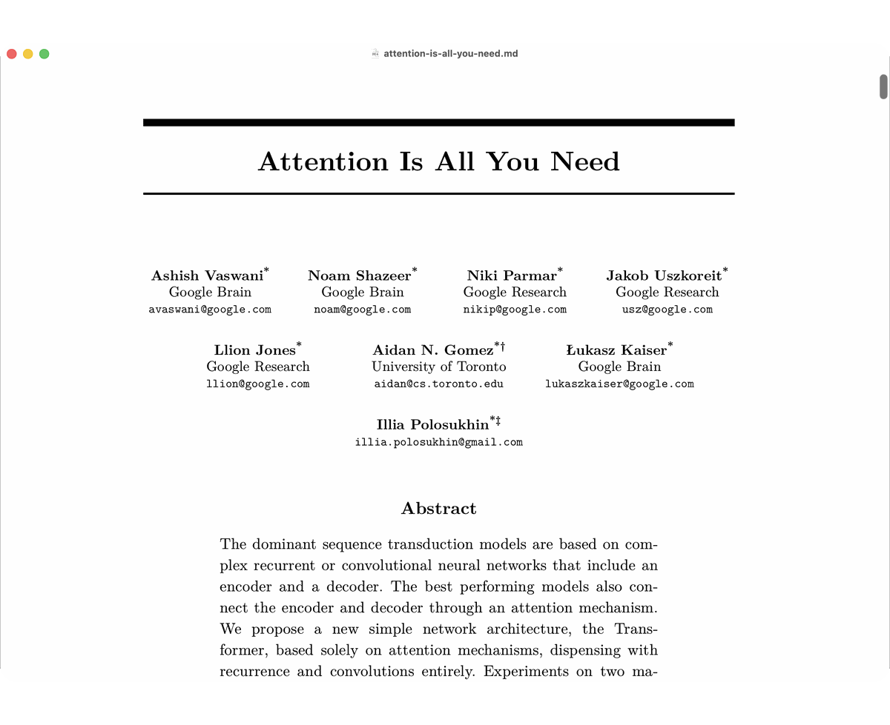
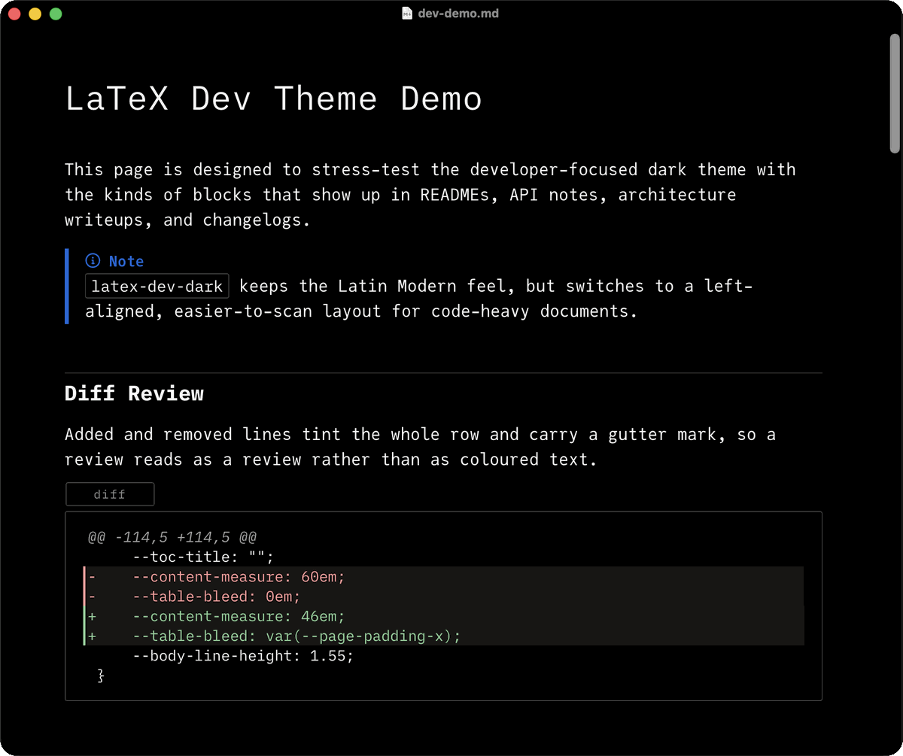

<div align="center">

&nbsp;&nbsp;&nbsp;

<sub>☀️ <strong>浅色模式</strong> &nbsp;—&nbsp; <code>latex.css</code> &nbsp;&nbsp;|&nbsp;&nbsp; 🌙 <strong>深色模式</strong> &nbsp;—&nbsp; <code>latex-dark.css</code></sub>

<br>


<br />
<sub>📄 使用浅色主题渲染的 <strong>《Attention Is All You Need》</strong></sub>
<br />
<sub>所有截图均在 Typora 中以 <strong>150% 缩放比例</strong>拍摄。</sub>

</div>

# ✍️ LaTeX Typora 主题

> 英文说明请见：[English README](./README.md)

受经典 LaTeX 文档启发的 Typora 主题 —— 为论文、文章与长篇阅读打造的学术排版风格。附带一个面向代码密集型 Markdown 的开发者深色变体。

## 特性

- **New Computer Modern 字体** —— 学术级衬线字体，支持更广泛的字符集
- **`article` 类页面几何** —— 行长、`\parindent`、`\parskip`、标题字号与章节间距均取自 letterpaper 11pt 的 `article.cls`
- **章节自动编号** —— `##`/`###`/`####` 依次编号为 `1`、`1.1`、`1.1.1`，编号与标题之间以 `\quad` 分隔，与 `\section` 一致
- **LaTeX 环境还原** —— 首行缩进、`quote` 式引用块、`itemize`/`enumerate` 标号（`•` `–` `∗`，`1.` `(a)` `i.`）、表格 `booktabs` 横线，以及 `\footnoterule` 下的 `\footnotesize` 脚注
- **Noto Nastaliq** —— 通过 HTML `lang` 属性增强乌尔都语与波斯语的正确字形渲染
- **跨平台 CJK 字体支持** ——
  - macOS 使用 Songti SC / Heiti SC 与 STSong / PingFang SC
  - Windows 使用 SimSun / NSimSun / Microsoft YaHei / SimHei
  - Linux 使用 Source Han / Noto CJK 字体
- **离线可用且自包含** —— 所有字体均在本地打包，无需外部依赖或 CDN；CJK 字体则使用当前操作系统自带的字体

## 自动安装

```bash
curl -fsSL https://raw.githubusercontent.com/shamsghi/LatexTypora/main/scripts/install.sh | bash
```

自动检测当前平台并安装到正确的 Typora 主题目录，支持 macOS、Linux 与 Windows（Git Bash / WSL）。

## 手动安装

1. 从 releases 页面下载并解压最新版本。
2. 在 Typora 中，前往 **Preferences → Appearance → Open Theme Folder**。
3. 将 `latex.css`、`latex-dark.css`、`latex-dev-dark.css` 以及 `latex_fonts/` 文件夹复制到主题目录中。
4. 重启 Typora，然后从 **Themes** 菜单选择对应主题。

<details>
<summary>安装选项</summary>

| 参数 | 说明 |
| :-- | :-- |
| `--theme-dir PATH` | 手动指定 Typora 主题目录 |
| `--ref REF` | 从指定分支、标签或提交安装 |

```bash
curl -fsSL https://raw.githubusercontent.com/shamsghi/LatexTypora/main/scripts/install.sh | bash -s -- --theme-dir "/custom/themes/path"
```

默认主题目录：

| 平台 | 路径 |
| :-- | :-- |
| macOS | `~/Library/Application Support/abnerworks.Typora/themes`（或沙盒等效路径） |
| Linux | `~/.config/Typora/themes` |
| Windows | `%APPDATA%\Typora\themes` |

</details>

#### 尽情享受 ❤️!

---

## `latex-dev-dark` — 开发者变体

<div align="center">
  
  <br />
  <sub>💻 <strong>开发者深色模式</strong> &nbsp;—&nbsp; <code>latex-dev-dark.css</code> &nbsp;·&nbsp; 以 <strong>125% 缩放比例</strong>拍摄</sub>
</div>

<br />

面向 README、API 文档、设计规范与变更日志打造。在 `latex-dark` 基础上扩展：

- **JuliaMono** 用于正文，**iA Writer Mono** 用于行内代码与界面强调
- 左对齐布局，版心约 76 个等宽字符——取消首行缩进、章节编号与 `[toc]` 标题
- **常驻语言标签**：每个围栏代码块上方都显示语言，阅读模式与导出同样保留，而不仅在获得焦点时出现
- **diff 审阅样式**：`diff` 围栏中的 `+`／`-` 行整行着色并带有左侧标记
- **文档型表格**：表头左对齐、隔行底色，单元格会换行显示长路径与 URL，而不是让整张表格横向滚动
- **可见滚动条**：围栏代码、宽表格与图表溢出时显示滚动条，避免看起来像被截断
- 沿用 `latex-dark` 的带边框 callout、引用块与 `kbd` 样式

围栏代码使用的 iA Writer Mono 不含任何连字查找表。若希望 `->`、`=>`、`<->`
连写成箭头，只需把 `--monospace` 指向文件中紧邻上方的 `"JuliaMono"` 字体
栈——相关的 contextual-alternates 规则已经就位。两款内置字体都不会把 `!=`、
`==`、`::` 连写。

参考演示文件：[`docs/dev-demo.md`](./docs/dev-demo.md)  
学术主题演示：[`docs/demo.md`](./docs/demo.md)

---

## 自定义

主题依赖的每一项 LaTeX 度量都是 `latex.css` 与 `latex-dark.css` 顶部的 `:root` 变量，无需翻找选择器即可调整版面。

| 变量 | 默认值 | 作用 |
| :-- | :-- | :-- |
| `--content-measure` | `32em` | 正文行长。`32em` 即 `article.cls` 的 345pt `\textwidth`，约每行 70 字符；需要更宽的版心可调大。 |
| `--paragraph-indent` | `1.55em` | `\parindent`。若偏好段间留白而非首行缩进，可设为 `0em` 并调大 `--paragraph-spacing`。 |
| `--paragraph-spacing` | `0em` | `\parskip`。 |
| `--body-line-height` | `1.38` | 行距。LaTeX 在 11pt 下的 `\baselineskip` 比例为 `1.236`。 |
| `--cjk-paragraph-indent` | `2em` | `zh`/`ja`/`ko` 段落的首行缩进，按中文排版惯例为两个全角字符。 |
| `--section-number-h2/h3/h4` | `counter(...)` | 标题编号。三者均设为 `""` 即可关闭编号。 |
| `--equation-number` | `""` | 行间公式编号。`$$…$$` 对应 LaTeX 不编号的 `\[ \]`，故默认关闭；设为 `"(" counter(latex-equation) ")"` 可像 `equation` 那样右对齐编号。 |
| `--toc-title` | `"Contents"` | `[toc]` 上方的标题，对应 `\tableofcontents`。设为 `""` 即可去掉。 |
| `--quote-indent`、`--quote-rule-width`、`--quote-padding`、`--quote-tint` | `2.5em`、`0px`、`0em`、`transparent` | 引用块按 LaTeX 的 `quote` 环境渲染。若想恢复带边框的面板样式，可将线宽设为 `2px`、内边距设为 `0.9em 1.2em 0.9em 1.4em`、底色设为 `var(--quote-bg-color)`。 |
| `--inline-code-bg-color` | 极浅底色 | 行内 `code` 不再描边，与 `\texttt` 一致。设为 `transparent` 可连底色一并去掉。 |
| `--table-bleed` | `var(--page-padding-x)` | 表格宽于版心时，可向页边距外延伸的距离；超出后由 figure 横向滚动。设为 `0em` 可让所有表格严格保持在版心内。 |
| `--list-indent`、`--list-topsep`、`--list-itemsep` | `2.5em`、`0.7em`、`0.32em` | 对应 `\leftmargini`、`\topsep` 与 `\itemsep`。 |

`latex-dev-dark.css` 会覆盖上述变量以适配开发文档：取消首行缩进、取消章节编号、取消 `[toc]` 标题，版心为 46em 等宽（约 76 字符）、左对齐正文、带边框的引用块，以及可延伸到页边距的满宽表格。它还新增了几个变量：

| 变量 | 默认值 | 作用 |
| :-- | :-- | :-- |
| `--diff-add-bg-color`、`--diff-remove-bg-color` | 淡绿／淡红 | `diff` 围栏中 `+`／`-` 行的整行底色。 |
| `--table-stripe-color` | 极淡白色 | 表格偶数行的隔行底色，设为 `transparent` 可关闭。 |
| `--scrollbar-thumb-color`、`--scrollbar-thumb-hover-color` | 半透明白色 | 围栏代码、宽表格与图表的滚动条颜色。 |
| `--nastaliq-line-height` | `1.95` | 乌尔都语／波斯语行距，较基础主题的 `2.15` 更紧凑。 |

### 图表配色

Mermaid 图表由 `:root` 中的第二组变量绘制，同样的六种色相分为**两层**。*墨色层*
用于一切细窄的元素——描边、柱、折线、散点——对页面的对比度不低于 4.6:1，1px 宽也
不会消失。唯一的例外是浅黄，为 3.3:1：黄色只要暗到 4.5:1 就会显得像橄榄绿而不是
黄色，而 3:1 正是图形边缘（而非文字）适用的阈值。墨色层上从不承载文字。*淡彩层*是不透明的浅色，用于面积足够大、按区域阅读的元素：桑基图色带、
饼图扇区、旅程图色块。浅色主题下正文墨色压在任一淡彩上仍有 13:1 以上，深色主题下
不低于 6:1，标签可以直接压上去。

六种色相依次为蓝、浅黄、青柠、紫、绿、青。色阶中没有红色——红色留给图表的报错面板，
因此图中出现红色一定意味着出了问题。排序上让循环中相邻的两色在色轮上尽量远离，整条
色阶在灰度打印下同样可辨。

| 变量 | 浅色 | 深色 | 作用 |
| :-- | :-- | :-- | :-- |
| `--diagram-series-1` … `-6` | `#2f5aa0` `#a28c22` `#55801f` `#78468c` `#2f7a52` `#2a6f7c` | `#8fb4e8` `#dfcd7b` `#b0d17c` `#cf9edb` `#7fca9c` `#79c2d2` | 墨色层——描边、XY 图的柱与折线、雷达曲线、Git 分支、提交点。 |
| `--diagram-series-1-fill` … `-6-fill` | `#c3d0e8` `#f4e7bb` `#d3e3ac` `#dcc7e0` `#bcdcc6` `#bcd8de` | `#3a4d68` `#5d5624` `#455528` `#57405f` `#2f553f` `#33555e` | 淡彩层——饼图扇区、桑基图色带、旅程图与时间线色块、矩形树图叶子、Packet 字段、看板栏、Venn 集合、方框填充。 |
| `--diagram-node-line-color`、`--diagram-node-fill-color` | 色阶 1 | 色阶 1 | 流程图与时序图的方框。各类结构图再各取一色——类图与需求图取色阶 4、ER 图取色阶 6、状态图与 Block 图取色阶 3——避免同一篇文档里的多张图糊成一片蓝。 |
| `--diagram-cluster-line-color`、`--diagram-cluster-fill-color` | 色阶 6，近白 | 色阶 6，近黑 | `subgraph` 方框、复合状态、矩形树图分区。 |
| `--diagram-note-line-color`、`--diagram-note-fill-color` | 浅黄 | 浅黄 | 注释与 `Note over` 方框——色阶中最暖的一色，让旁注一眼可辨。 |
| `--diagram-edge-color`、`--diagram-ink-color` | 62% / 72% 黑 | 68% / 78% 白 | 连线、箭头与主干。结构一律用墨色，箭头不与它所连接的内容争夺注意力。 |
| `--diagram-muted-line-color` | 26% 黑 | 30% 白 | 网格线、坐标轴、生命线、分隔线、桑基图节点条。 |
| `--diagram-pie-fill-opacity` | `1` | `1` | 饼图扇区的填充浓度。调低则接近描边而非色块。 |
| `--diagram-sankey-link-opacity`、`--diagram-sankey-link-blend-mode` | `0.85`、`multiply` | `0.9`、`screen` | 色带浓度与重叠混合方式。 |
| `--diagram-knockout-color` | `#ffffff` | `#000000` | 压在色块上反白的图形——架构图标、`autonumber` 序号。 |

桑基图保留 Mermaid 由源节点到目标节点的渐变：主题改写的是渐变的色标，而不是把每条
色带压平成单一颜色，因此仍能看出色带的来处与去处。

`--mermaid-theme`（浅色 `neutral`、深色 `dark`）决定 Typora 交给 Mermaid 的基础
主题，上述变量再覆盖其配色。

## 说明

- 采用 **Apache-2.0** 许可证发布，重新分发主题时请保留 `LICENSE`。
- 内置字体的署名与许可证说明见 [`docs/THIRD_PARTY_NOTICES.md`](./docs/THIRD_PARTY_NOTICES.md)；重新分发打包字体时请保留其中相关说明。
- 在 macOS 上设计与测试，Windows 与 Linux 上应同样可用。
- 颜色、字体与全部 LaTeX 度量均为各主题文件顶部的 `:root` 变量，详见[自定义](#自定义)。
