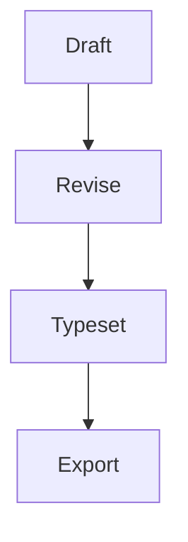

# LaTeX Typora Theme

## Abstract

The quick brown fox jumps over the lazy dog while **bold text**, **italic text**, `inline code`, and ==highlighted text== sit together in the same paragraph. A link to [Typora](https://typora.io) keeps the treatment minimal and print-friendly.[^demo-note]

> Good document themes disappear into the reading experience while still giving structure, hierarchy, and a little ceremony to the page.

## Prose

Paragraphs follow the `article` class: `\parskip` is zero and a new paragraph is announced by its first-line indent instead of by a blank band of space. The first paragraph after a heading is left flush, exactly as LaTeX does without the `indentfirst` package.

This second paragraph is indented, which is the whole point of the demonstration. Justification and automatic hyphenation are on, so the right edge stays flush and the word spacing stays even across the measure.

## Formulas

Inline math such as $e^{i\pi} + 1 = 0$ blends into the prose, while display math gets a little more room:
$$
\int_0^1 x^2 \, dx = \frac{1}{3}
$$

## Alerts

> [!NOTE]
> Typora can render GitHub-style alerts when the feature is enabled in preferences, and the LaTeX themes now give them a more document-like treatment.

> [!CAUTION]
> This syntax is Typora- and GitHub-friendly, but it is still less portable than plain blockquotes across older Markdown tooling.

## Structure

### Lists

- Serif body text for long-form reading
- Monospace blocks for code and metadata
  - Nested levels use LaTeX's own labels
    - Bullet, en dash, then asterisk
- Subtle rules for quotes, tables, and footnotes

1. Open the file in Typora.
2. Switch between `latex` and `latex-dark`.
   1. Nested enumerations are lettered
   2. Just as `\labelenumii` prescribes
3. Scroll slowly and notice the spacing.

### Tasks

- [ ] Review the manuscript layout
- [ ] Compile the equations
- [ ] Export the final PDF

### Table

| Element | What to notice |
| :-- | :-- |
| Heading | Centered title and calm hierarchy |
| Paragraph | Justified body copy with even texture |
| Code | Latin Modern Mono with thin borders |
| Table | Top and bottom rules in a classic academic style |

## Technical Samples

Inline math such as $e^{i\pi} + 1 = 0$ blends into the prose, while display math gets a little more room:

$$
\int_0^1 x^2 \, dx = \frac{1}{3}
$$

```python
def greet(theme: str) -> str:
    return f"{theme} makes Markdown feel typeset."

print(greet("LaTeX Typora"))
```



## CJK Mixed Typography

This untagged paragraph mixes English with 中文标点、Japanese punctuation「約物」、and Korean 문장 부호 to show the conservative default behavior for ordinary Markdown.

<h3 lang="zh">中文标题：排版、标点与节奏</h3>

<p lang="zh">这是一段中文正文，用来测试行高、避头尾标点与中英文混排效果。The theme should keep Latin words readable while Chinese punctuation，例如逗号、句号、冒号、引号“示例”，保持自然的排版节奏。</p>

<blockquote lang="zh">
<p>中文引用块用于检查引用中的 CJK 行高、标点节奏和整体灰度。引用块里的中文应该比默认拉丁行高更舒展。</p>
</blockquote>

<h3 lang="ja">日本語の見出し：約物と行間</h3>

<p lang="ja">これは日本語本文のテストです。句読点、括弧「サンプル」、中黒・ダッシュ、そして English words を混ぜたときの読みやすさを確認します。行間が詰まりすぎず、見出しとの間隔も自然に見えることを確認してください。</p>

<ul lang="ja">
<li>番号付きではないリストで日本語の行間を確認します。</li>
<li>混在する Markdown、Typora、PDF export の語を含みます。</li>
</ul>

<h3 lang="ko">한국어 제목: 줄 간격과 문장 부호</h3>

<p lang="ko">이 문단은 한국어 본문 테스트입니다. 한글 문장 부호, 괄호(예시), 따옴표 “샘플”, 그리고 English words 가 섞였을 때 줄바꿈과 글꼴 선택이 자연스러운지 확인합니다.</p>

<ul lang="ko">
<li>목록 항목에서 한글 줄 높이와 여백을 확인합니다.</li>
<li>긴 단어와 라틴 단어가 함께 있을 때 어색하게 잘리지 않는지 봅니다.</li>
</ul>

## Urdu and Persian

<div lang="ur">
<h3>اردو نستعلیق نمونہ</h3>
<p>یہ پیراگراف اردو عبارت کو نستعلیق رسم الخط، زیادہ سطری بلندی، اور دائیں سے بائیں بہاؤ کے ساتھ دکھاتا ہے تاکہ متن آرام سے پڑھا جا سکے۔</p>
<blockquote>
<p>اچھی طباعت متن کو نمایاں کیے بغیر اسے وقار، بہاؤ اور ترتیب دیتی ہے۔</p>
</blockquote>
<ul>
<li>سرخیوں میں نرم بہاؤ</li>
<li>اقتباس میں دائیں کنارے کی لکیر</li>
<li>فہرست میں دائیں جانب درست وقفہ</li>
</ul>
</div>

<p lang="fa">این پاراگراف فارسی را با همان قلم نستعلیق و فاصلهٔ عمودی بلندتر نشان می‌دهد تا بافت متن یکنواخت و خوانا بماند.</p>

<p>This line keeps English prose in the default face while <span lang="ur">اردو کا یہ حصہ</span> and <span lang="fa">این بخش فارسی</span> switch to Nastaliq inline.</p>

## Greek and Ancient Greek

<p lang="el">Η νέα γραμματοσειρά κειμένου αποδίδει καθαρά τα ελληνικά, με ισορροπημένο ρυθμό και διακριτές μορφές.</p>

<p lang="grc">Ἀνὴρ σοφὸς μέτρον ζητεῖ, καὶ λόγος ἀκριβὴς τὴν διάνοιαν φωτίζει.</p>

<p lang="grc">ἀ, ἁ, ἂ, ἃ, ἄ, ἅ, ἆ, ἇ · ᾄ, ᾅ, ᾆ, ᾇ · ῥ, Ῥ · ᾳ, ῃ, ῳ · ͵Α, ϛ, ϟ, ϡ</p>

---

## Closing Note

This short file is meant to be scanned, not studied, so each block exists to show a different piece of the theme in a single page.

[^demo-note]: Footnotes are styled quietly so they read like scholarly apparatus instead of UI chrome.
