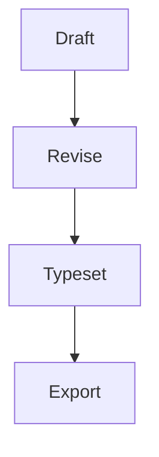

# LaTeX Typora Theme

## Abstract

The quick brown fox jumps over the lazy dog while **bold text**, **italic text**, `inline code`, and ==highlighted text== sit together in the same paragraph. A link to [Typora](https://typora.io) keeps the treatment minimal and print-friendly.[^demo-note]

> Good document themes disappear into the reading experience while still giving structure, hierarchy, and a little ceremony to the page.

## Formulas

Inline math such as $e^{i\pi} + 1 = 0$ blends into the prose, while display math gets a little more room:
$$
\int_0^1 x^2 \, dx = \frac{1}{3}
$$

## Alerts

> [!NOTE]
> Typora can render GitHub-style alerts when the feature is enabled in preferences, and the LaTeX themes now give them a more document-like treatment.

> [!CAUTION]
> This syntax is Typora- and GitHub-friendly, but it is still less portable than plain blockquotes across older Markdown tooling.

## Structure

### Lists

- Serif body text for long-form reading
- Monospace blocks for code and metadata
- Subtle rules for quotes, tables, and footnotes

1. Open the file in Typora.
2. Switch between `latex` and `latex-dark`.
3. Scroll slowly and notice the spacing.

### Tasks

- [ ] Review the manuscript layout
- [ ] Compile the equations
- [ ] Export the final PDF

### Table

| Element | What to notice |
| :-- | :-- |
| Heading | Centered title and calm hierarchy |
| Paragraph | Justified body copy with even texture |
| Code | Latin Modern Mono with thin borders |
| Table | Top and bottom rules in a classic academic style |

## Technical Samples

Inline math such as $e^{i\pi} + 1 = 0$ blends into the prose, while display math gets a little more room:

$$
\int_0^1 x^2 \, dx = \frac{1}{3}
$$

```python
def greet(theme: str) -> str:
    return f"{theme} makes Markdown feel typeset."

print(greet("LaTeX Typora"))
```



## Urdu and Persian

<div lang="ur">
<h3>اردو نستعلیق نمونہ</h3>
<p>یہ پیراگراف اردو عبارت کو نستعلیق رسم الخط، زیادہ سطری بلندی، اور دائیں سے بائیں بہاؤ کے ساتھ دکھاتا ہے تاکہ متن آرام سے پڑھا جا سکے۔</p>
<blockquote>
<p>اچھی طباعت متن کو نمایاں کیے بغیر اسے وقار، بہاؤ اور ترتیب دیتی ہے۔</p>
</blockquote>
<ul>
<li>سرخیوں میں نرم بہاؤ</li>
<li>اقتباس میں دائیں کنارے کی لکیر</li>
<li>فہرست میں دائیں جانب درست وقفہ</li>
</ul>
</div>

<p lang="fa">این پاراگراف فارسی را با همان قلم نستعلیق و فاصلهٔ عمودی بلندتر نشان می‌دهد تا بافت متن یکنواخت و خوانا بماند.</p>

<p>This line keeps English prose in the default face while <span lang="ur">اردو کا یہ حصہ</span> and <span lang="fa">این بخش فارسی</span> switch to Nastaliq inline.</p>

## Greek and Ancient Greek

<p lang="el">Η νέα γραμματοσειρά κειμένου αποδίδει καθαρά τα ελληνικά, με ισορροπημένο ρυθμό και διακριτές μορφές.</p>

<p lang="grc">Ἀνὴρ σοφὸς μέτρον ζητεῖ, καὶ λόγος ἀκριβὴς τὴν διάνοιαν φωτίζει.</p>

<p lang="grc">ἀ, ἁ, ἂ, ἃ, ἄ, ἅ, ἆ, ἇ · ᾄ, ᾅ, ᾆ, ᾇ · ῥ, Ῥ · ᾳ, ῃ, ῳ · ͵Α, ϛ, ϟ, ϡ</p>

---

## Closing Note

This short file is meant to be scanned, not studied, so each block exists to show a different piece of the theme in a single page.

[^demo-note]: Footnotes are styled quietly so they read like scholarly apparatus instead of UI chrome.
