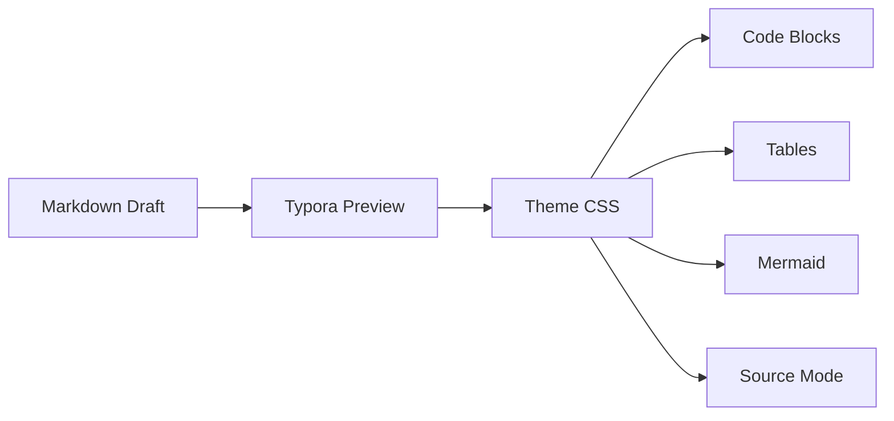

# LaTeX Dev Theme Demo

This page is designed to stress-test the developer-focused dark theme with the kinds of blocks that show up in READMEs, API notes, architecture writeups, and changelogs.

## Quick Commands

Run `pnpm build`, inspect `src/routes/api.ts`, then use <kbd>Cmd</kbd> + <kbd>Shift</kbd> + <kbd>P</kbd> to reopen the command palette.

```bash
sfw pnpm install
sfw pnpm lint
sfw pnpm test
```

> [!NOTE]
> `latex-dev-dark` keeps the Latin Modern feel, but switches to a left-aligned, easier-to-scan layout for code-heavy documents.

## Alerts

> [!TIP]
> Callouts now get dedicated theme styling instead of inheriting the plain blockquote treatment.

> [!IMPORTANT]
> Enable GitHub Style Alerts in Typora preferences first, or these blocks will stay as ordinary blockquotes.

> [!WARNING]
> If you export to Markdown for older tooling, alerts may not survive as richly as standard paragraphs and headings.

> [!CAUTION]
> Use alerts for emphasis, not structure. Long specs still read best when most of the hierarchy comes from headings.

## JSON and YAML

```json
{
  "name": "latex-typora-theme",
  "private": true,
  "scripts": {
    "check": "sfw pnpm lint && sfw pnpm test",
    "release": "sfw pnpm build"
  }
}
```

```yaml
name: CI
on:
  pull_request:
    branches: [main]
jobs:
  checks:
    runs-on: ubuntu-latest
    steps:
      - uses: actions/checkout@v4
      - run: sfw pnpm install --frozen-lockfile
      - run: sfw pnpm test
```

## Diff Review

Added and removed lines tint the whole row and carry a gutter mark, so a
review reads as a review rather than as coloured text.

```diff
--- a/latex-dev-dark.css
+++ b/latex-dev-dark.css
@@ -114,7 +114,7 @@
     --toc-title: "";
-    --content-measure: 60em;
-    --table-bleed: 0em;
+    --content-measure: 46em;
+    --table-bleed: var(--page-padding-x);
     --body-line-height: 1.55;
 }
```

## Fence Labels and Overflow

A fence with no language gets no label; the two below do, and the label
stays put in reading mode and in exports.

```
$ git log --oneline -3
c39bfa6 chore(docs): relocate font licenses into LICENSES folder
d0a9fb1 feat(theme): improve LaTeX typographic fidelity
```

A line far wider than the measure should scroll horizontally with a
scrollbar visible at rest, not look truncated:

```sh
docker run --rm -it --network host -v "$PWD:/work" -w /work -e CI=1 -e NODE_OPTIONS=--max-old-space-size=4096 node:22-bookworm bash -lc 'corepack enable && pnpm install --frozen-lockfile && pnpm test -- --reporter=verbose'
```

Digits and letters that collide in most faces — `0O` `1lI` `5S` `8B` `2Z`
— should stay distinct at code size:

```python
CHECKSUM = 0xB0071E5
timeout_ms = 30000
ratio = 1.0 / 3.0  # 0.333...
```

## Task List

- [x] Make inline code easier to spot
- [x] Improve code-fence readability
- [x] Add `kbd` styling for shortcuts
- [ ] Tune screenshot framing against more real-world docs

## Wide Table

| Endpoint | Method | Auth | Notes | Example |
| :-- | :-- | :-- | :-- | :-- |
| `/api/themes` | `GET` | Optional | Returns available theme IDs and human labels. | `curl https://example.dev/api/themes` |
| `/api/themes/{id}` | `PATCH` | Required | Updates theme metadata and returns the saved record. | `curl -X PATCH https://example.dev/api/themes/latex-dev-dark -d '{"enabled":true}'` |
| `/api/previews/export` | `POST` | Required | Generates a preview bundle for docs review. | `curl -X POST https://example.dev/api/previews/export -F file=@README.md` |

## Option Table

Header cells align with their column, rows stripe, and figures line up.

| Flag | Default | Timeout (ms) | Retries | Description |
| :-- | :-- | --: | --: | :-- |
| `--theme-dir` | *(platform)* | 0 | 0 | Override the target Typora theme directory. |
| `--ref` | `main` | 15000 | 3 | Install from a specific branch, tag, or commit. |
| `--concurrency` | `4` | 900 | 10 | Parallel download slots for bundled font files. |
| `--verify` | `true` | 120000 | 1 | Re-hash every installed asset after writing it. |
| `--log-level` | `info` | 50 | 0 | One of `silent`, `error`, `warn`, `info`, `debug`. |

Long values wrap inside the cell instead of forcing the whole table to
scroll: see `https://raw.githubusercontent.com/shamsghi/LatexTypora/main/scripts/install.sh`
and `~/Library/Application Support/abnerworks.Typora/themes/latex-dev-dark.css`.

## Nested Structure

1. Resolve the theme directory
   - macOS sandboxed path first
   - then `~/.config/Typora/themes`
     - finally `%APPDATA%\Typora\themes`
2. Copy `latex_fonts/`
3. Verify the install[^verify]

[^verify]: Footnotes keep the `\footnotesize` treatment from the base theme
and sit under a rule at the end of the document.

## Architecture Sketch



## Mixed Prose

Keep `README.md` readable in preview, make code examples easy to scan, and preserve enough typographic discipline that long-form docs still feel deliberate instead of looking like a generic app note.

## Non-Latin Text

<p lang="zh">这一段用来检查中日韩文本的行距与段落节奏：开发主题保留正文的等宽字体，但把行高和段间距调整到适合阅读长文档的比例。</p>

<p lang="ur">یہ سطر اردو رسم الخط کی جانچ کے لیے ہے۔ ترقیاتی تھیم میں بھی متن دائیں سے بائیں ہی چلنا چاہیے۔</p>

## Print Check

Export this page to PDF. The output should be dark text on white with the
syntax highlighting intact — the dark palette is a reading choice, not a
document.
