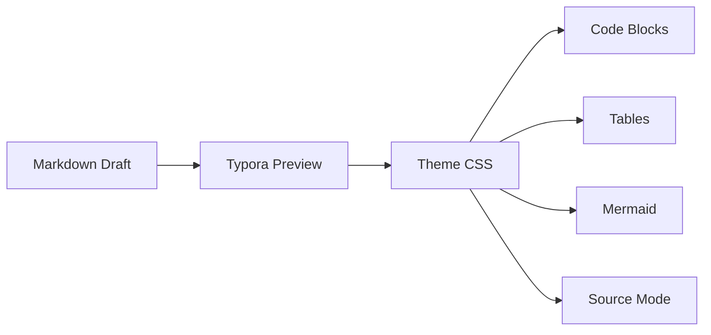

# LaTeX Dev Theme Demo

This page is designed to stress-test the developer-focused dark theme with the kinds of blocks that show up in READMEs, API notes, architecture writeups, and changelogs.

## Quick Commands

Run `pnpm build`, inspect `src/routes/api.ts`, then use <kbd>Cmd</kbd> + <kbd>Shift</kbd> + <kbd>P</kbd> to reopen the command palette.

```bash
sfw pnpm install
sfw pnpm lint
sfw pnpm test
```

> [!NOTE]
> `latex-dev-dark` keeps the Latin Modern feel, but switches to a left-aligned, easier-to-scan layout for code-heavy documents.

## Alerts

> [!TIP]
> Callouts now get dedicated theme styling instead of inheriting the plain blockquote treatment.

> [!IMPORTANT]
> Enable GitHub Style Alerts in Typora preferences first, or these blocks will stay as ordinary blockquotes.

> [!WARNING]
> If you export to Markdown for older tooling, alerts may not survive as richly as standard paragraphs and headings.

> [!CAUTION]
> Use alerts for emphasis, not structure. Long specs still read best when most of the hierarchy comes from headings.

## JSON and YAML

```json
{
  "name": "latex-typora-theme",
  "private": true,
  "scripts": {
    "check": "sfw pnpm lint && sfw pnpm test",
    "release": "sfw pnpm build"
  }
}
```

```yaml
name: CI
on:
  pull_request:
    branches: [main]
jobs:
  checks:
    runs-on: ubuntu-latest
    steps:
      - uses: actions/checkout@v4
      - run: sfw pnpm install --frozen-lockfile
      - run: sfw pnpm test
```

## Diff Review

```diff
- color: inherit;
+ color: var(--link-color);

- background-color: var(--surface-color);
+ background-color: var(--code-bg-color);
```

## Task List

- [x] Make inline code easier to spot
- [x] Improve code-fence readability
- [x] Add `kbd` styling for shortcuts
- [ ] Tune screenshot framing against more real-world docs

## Wide Table

| Endpoint | Method | Auth | Notes | Example |
| :-- | :-- | :-- | :-- | :-- |
| `/api/themes` | `GET` | Optional | Returns available theme IDs and human labels. | `curl https://example.dev/api/themes` |
| `/api/themes/{id}` | `PATCH` | Required | Updates theme metadata and returns the saved record. | `curl -X PATCH https://example.dev/api/themes/latex-dev-dark -d '{"enabled":true}'` |
| `/api/previews/export` | `POST` | Required | Generates a preview bundle for docs review. | `curl -X POST https://example.dev/api/previews/export -F file=@README.md` |

## Architecture Sketch



## Mixed Prose

Keep `README.md` readable in preview, make code examples easy to scan, and preserve enough typographic discipline that long-form docs still feel deliberate instead of looking like a generic app note.
