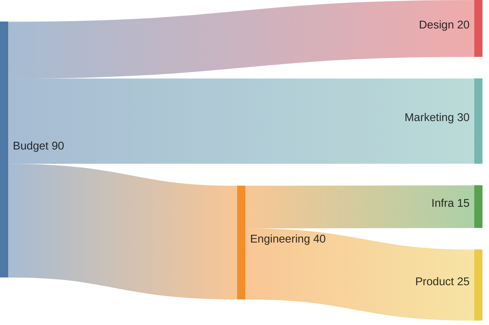
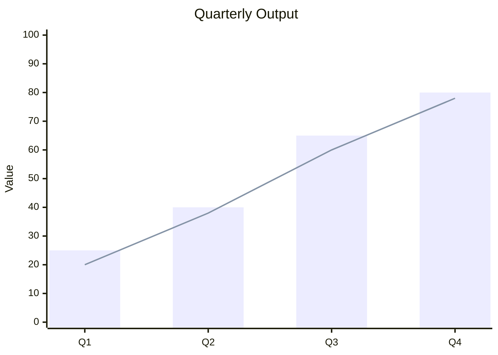
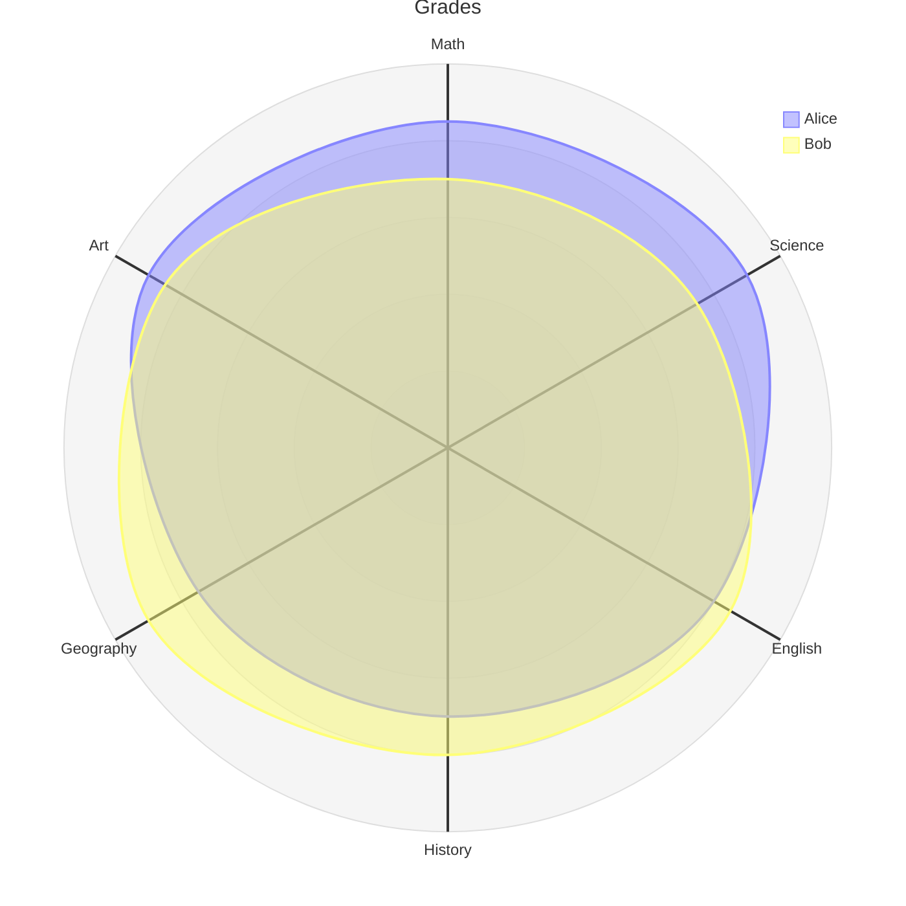
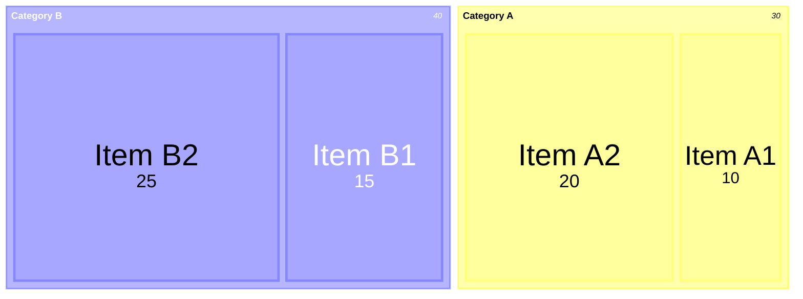
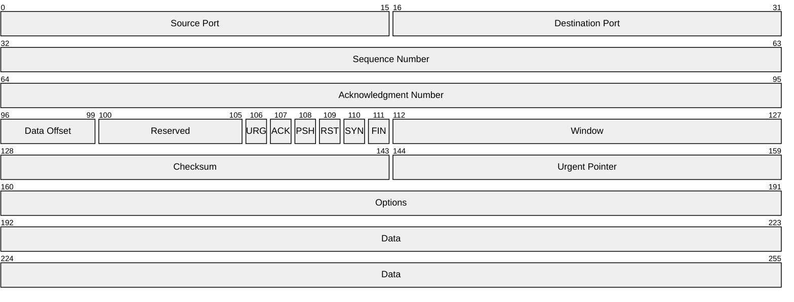
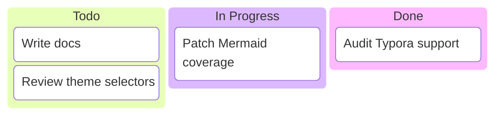
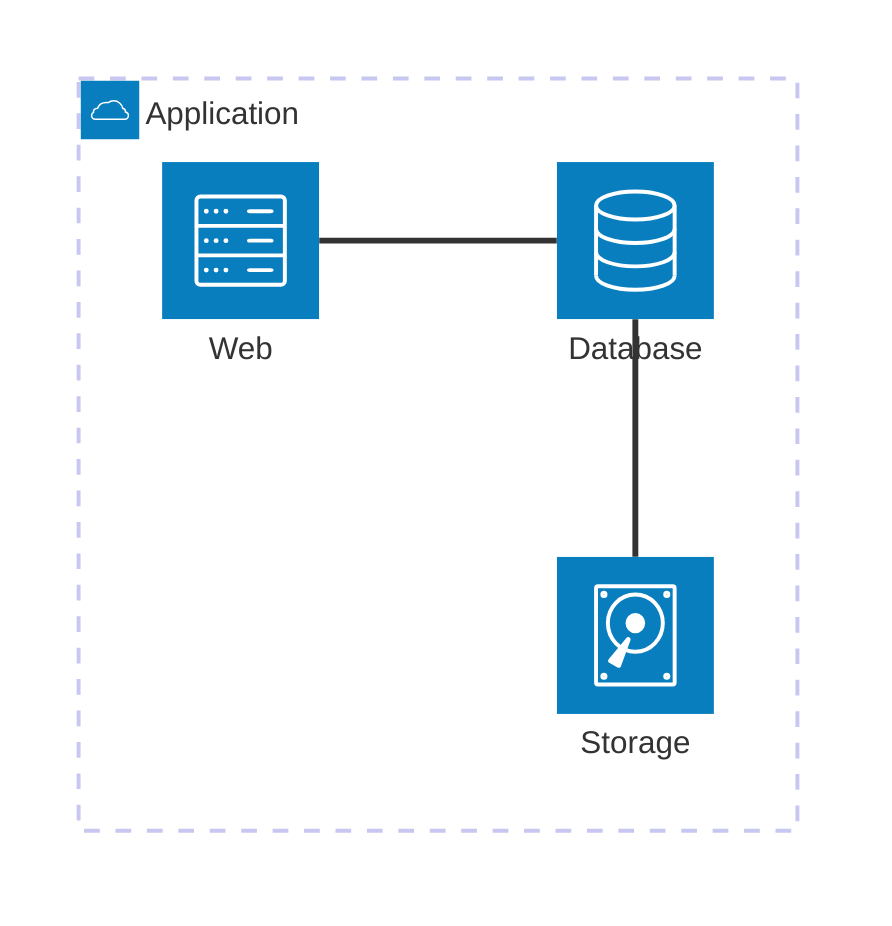
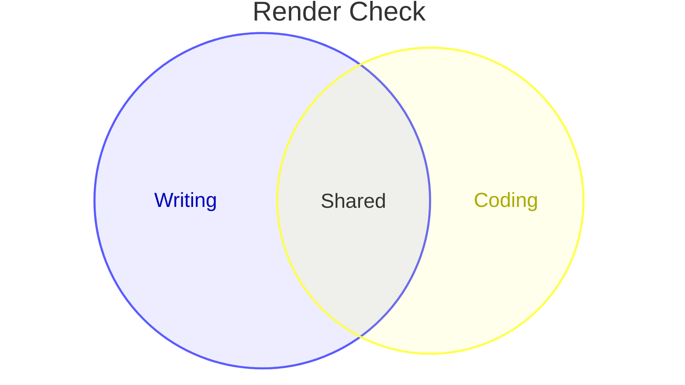
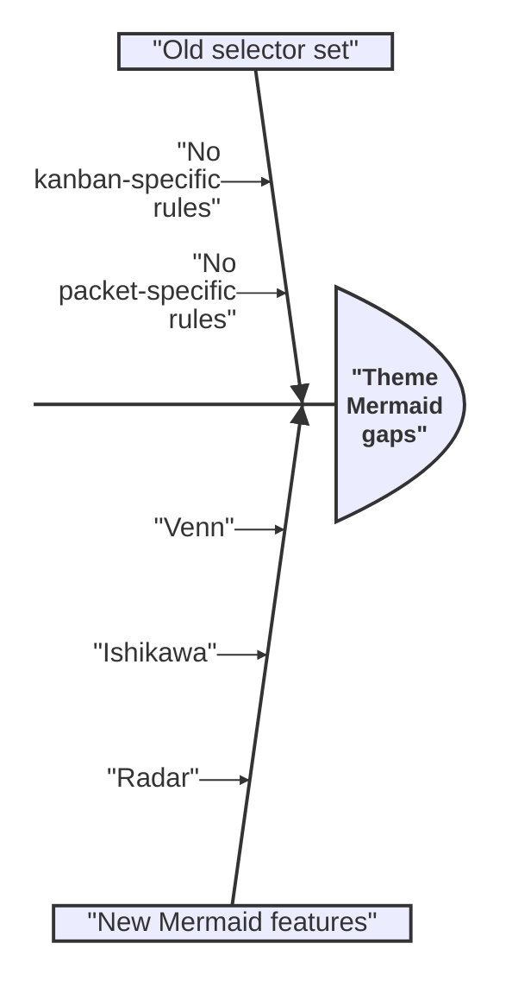

# Mermaid Coverage Check

## Sankey

```mermaid
sankey-beta
Budget,Engineering,40
Budget,Design,20
Budget,Marketing,30
Engineering,Infra,15
Engineering,Product,25
```

## XY Chart

```mermaid
xychart-beta
    title "Quarterly Output"
    x-axis [Q1, Q2, Q3, Q4]
    y-axis "Value" 0 --> 100
    bar [25, 40, 65, 80]
    line [20, 38, 60, 78]
```

## Radar

```mermaid
---
title: "Grades"
---
radar-beta
  axis m["Math"], s["Science"], e["English"]
  axis h["History"], g["Geography"], a["Art"]
  curve alice["Alice"]{85, 90, 80, 70, 75, 90}
  curve bob["Bob"]{70, 75, 85, 80, 90, 85}
  max 100
  min 0
```

## Treemap

```mermaid
treemap-beta
"Category A"
    "Item A1": 10
    "Item A2": 20
"Category B"
    "Item B1": 15
    "Item B2": 25
```

## Packet

```mermaid
packet-beta
0-15: "Source Port"
16-31: "Destination Port"
32-63: "Sequence Number"
64-95: "Acknowledgment Number"
96-99: "Data Offset"
100-105: "Reserved"
106: "URG"
107: "ACK"
108: "PSH"
109: "RST"
110: "SYN"
111: "FIN"
112-127: "Window"
128-143: "Checksum"
144-159: "Urgent Pointer"
160-191: "Options"
192-255: "Data"
```

## Kanban

```mermaid
kanban
  todo[Todo]
    docs[Write docs]
    review[Review theme selectors]
  progress[In Progress]
    fix[Patch Mermaid coverage]
  done[Done]
    audit[Audit Typora support]
```

## Architecture

```mermaid
architecture-beta
    group app(cloud)[Application]
    service web(server)[Web] in app
    service db(database)[Database] in app
    service disk1(disk)[Storage] in app
    web:R -- L:db
    db:B -- T:disk1
```

## Venn

```mermaid
venn-beta
title Render Check
set A["Writing"]:12
set B["Coding"]:10
union A,B["Shared"]:4
```

## Ishikawa

```mermaid
ishikawa-beta
  "Theme Mermaid gaps"
    "Old selector set"
      "No kanban-specific rules"
      "No packet-specific rules"
    "New Mermaid features"
      "Venn"
      "Ishikawa"
      "Radar"
```
