# Mermaid Coverage Check

Every diagram type the theme paints, so a palette change can be checked in one
pass. Open it in both `latex.css` and `latex-dark.css`.

## Flowchart

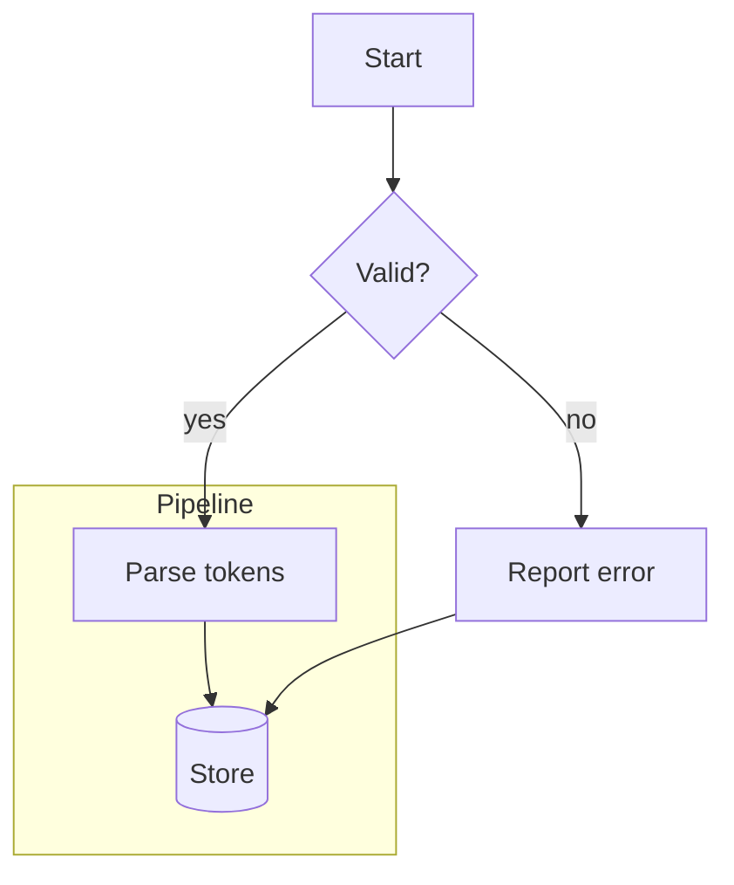
```mermaid
flowchart TD
  A[Start] --> B{Valid?}
  B -- yes --> C[Parse tokens]
  B -- no --> D[Report error]
  C --> E[(Store)]
  D --> E
  subgraph Pipeline
    C
    E
  end
```

## Sequence

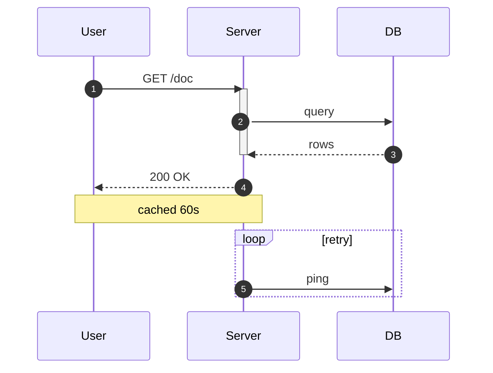
```mermaid
sequenceDiagram
  autonumber
  participant U as User
  participant S as Server
  participant D as DB
  U->>S: GET /doc
  activate S
  S->>D: query
  D-->>S: rows
  deactivate S
  S-->>U: 200 OK
  Note over U,S: cached 60s
  loop retry
    S->>D: ping
  end
```

## Class

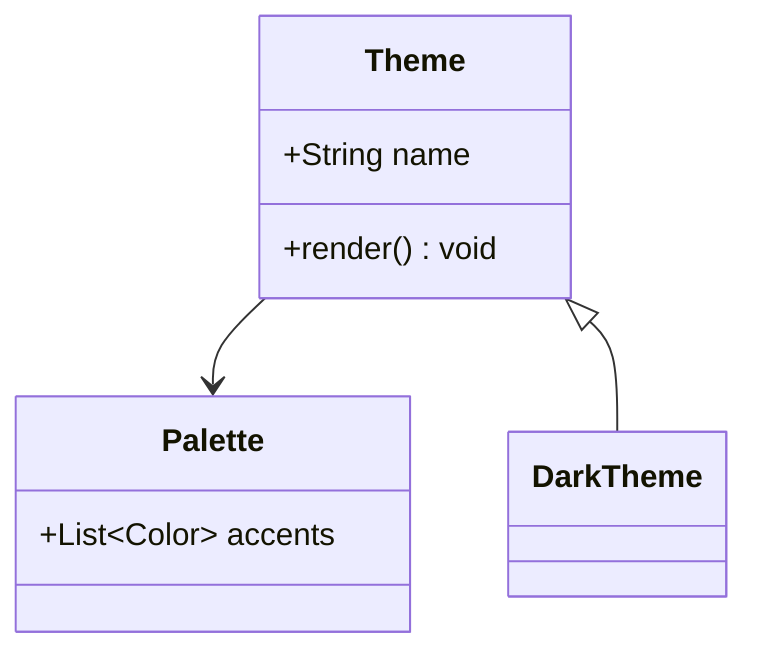
```mermaid
classDiagram
  class Theme {
    +String name
    +render() void
  }
  class Palette {
    +List~Color~ accents
  }
  Theme --> Palette
  Theme <|-- DarkTheme
```

## State

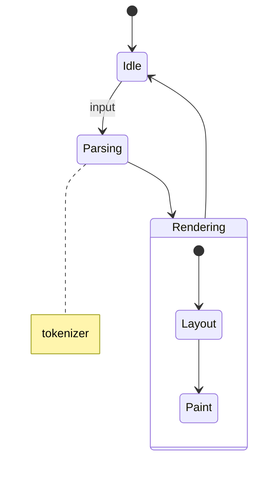
```mermaid
stateDiagram-v2
  [*] --> Idle
  Idle --> Parsing: input
  Parsing --> Rendering
  Rendering --> Idle
  note right of Parsing: tokenizer
  state Rendering {
    [*] --> Layout
    Layout --> Paint
  }
```

## Entity Relationship

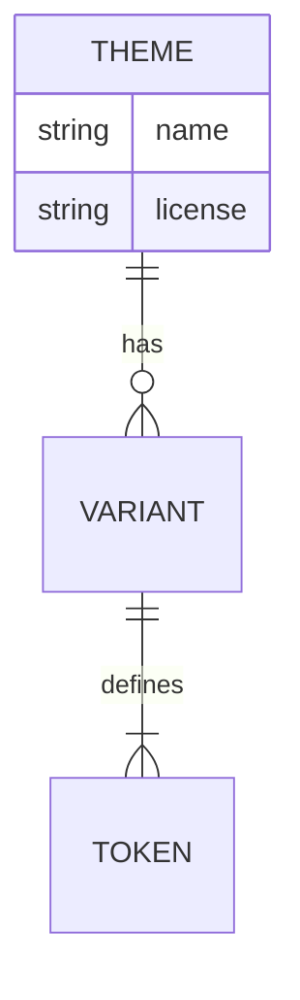
```mermaid
erDiagram
  THEME ||--o{ VARIANT : has
  VARIANT ||--|{ TOKEN : defines
  THEME {
    string name
    string license
  }
```

## Pie

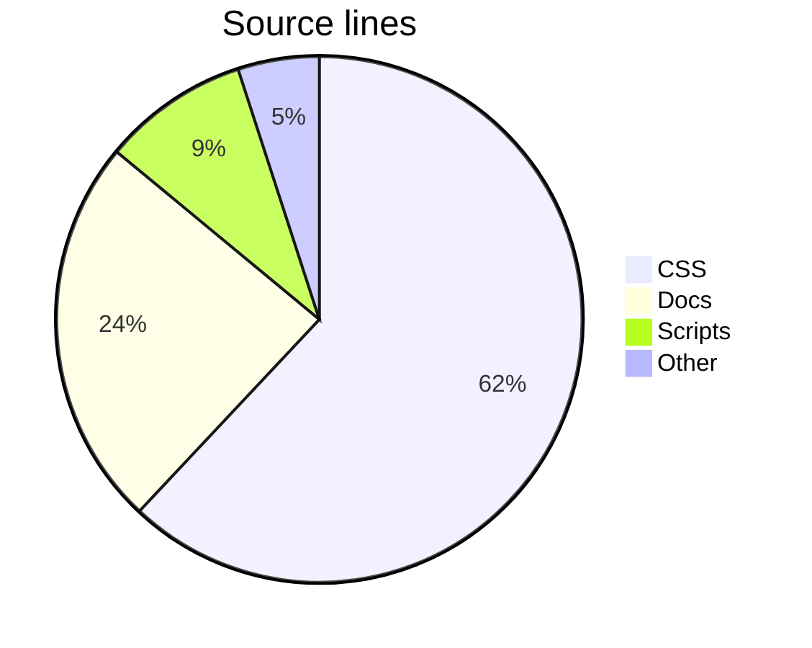
```mermaid
pie title Source lines
  "CSS" : 62
  "Docs" : 24
  "Scripts" : 9
  "Other" : 5
```

## Gantt

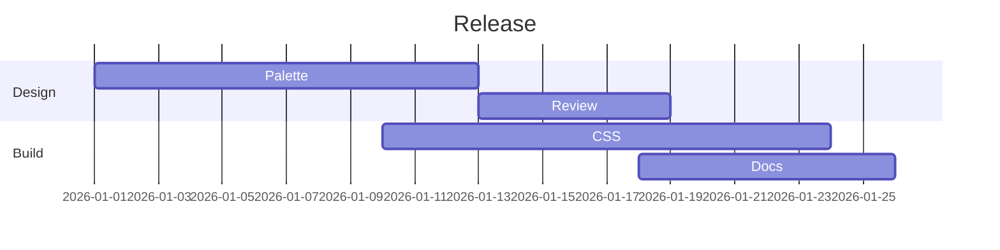
```mermaid
gantt
  title Release
  dateFormat YYYY-MM-DD
  section Design
  Palette :a1, 2026-01-01, 12d
  Review  :after a1, 6d
  section Build
  CSS     :2026-01-10, 14d
  Docs    :2026-01-18, 8d
```

## Git Graph

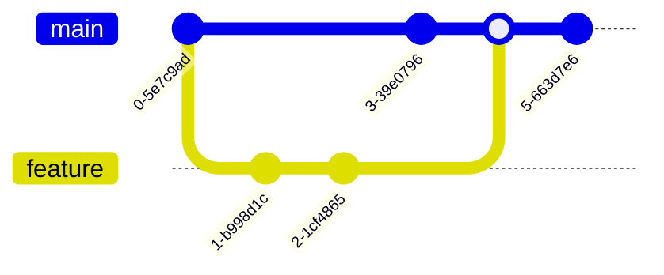
```mermaid
gitGraph
  commit
  branch feature
  commit
  commit
  checkout main
  commit
  merge feature
  commit
```

## Journey

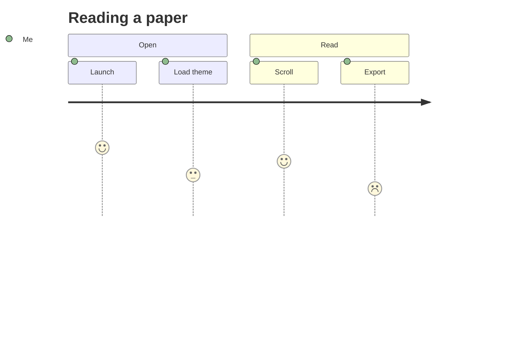
```mermaid
journey
  title Reading a paper
  section Open
    Launch: 5: Me
    Load theme: 3: Me
  section Read
    Scroll: 4: Me
    Export: 2: Me
```

## Mindmap

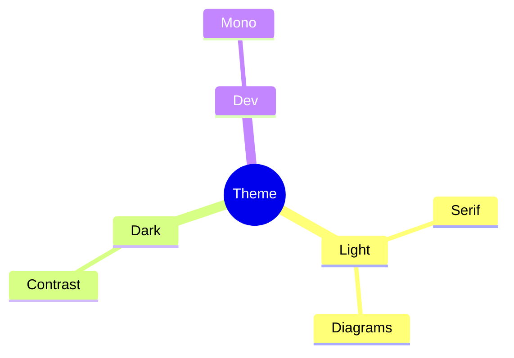
```mermaid
mindmap
  root((Theme))
    Light
      Serif
      Diagrams
    Dark
      Contrast
    Dev
      Mono
```

## Timeline

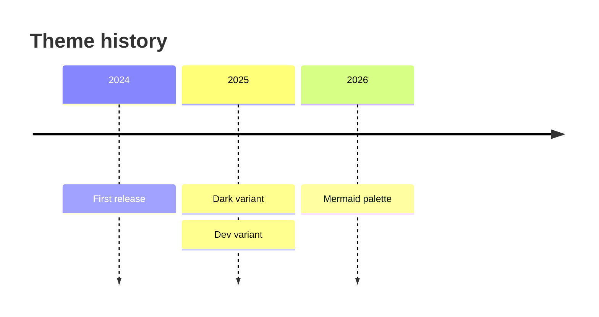
```mermaid
timeline
  title Theme history
  2024 : First release
  2025 : Dark variant : Dev variant
  2026 : Mermaid palette
```

## Quadrant

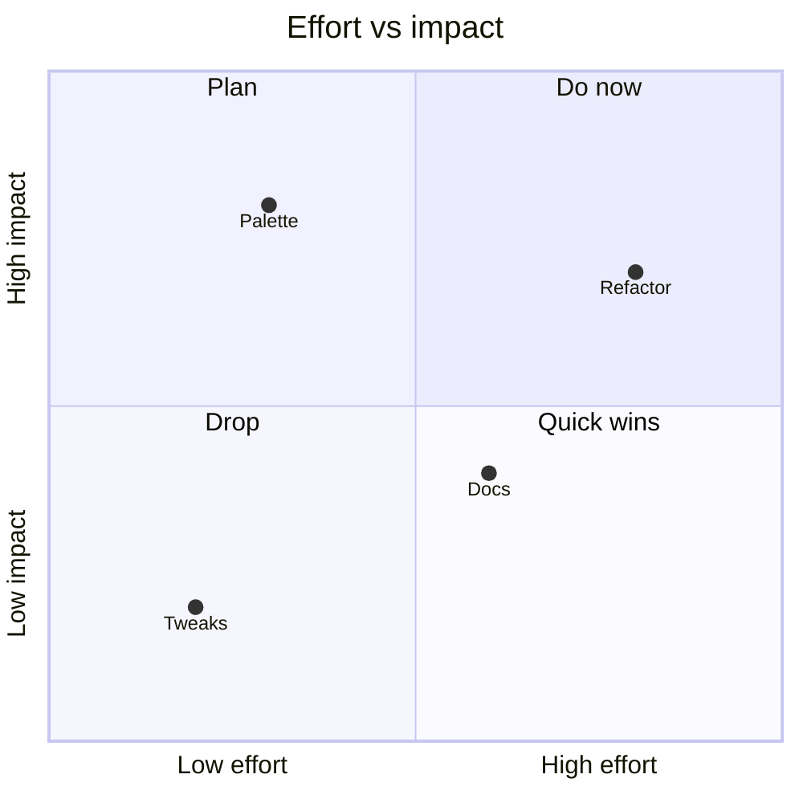
```mermaid
quadrantChart
  title Effort vs impact
  x-axis Low effort --> High effort
  y-axis Low impact --> High impact
  quadrant-1 Do now
  quadrant-2 Plan
  quadrant-3 Drop
  quadrant-4 Quick wins
  Palette: [0.3, 0.8]
  Docs: [0.6, 0.4]
  Refactor: [0.8, 0.7]
  Tweaks: [0.2, 0.2]
```

## Requirement

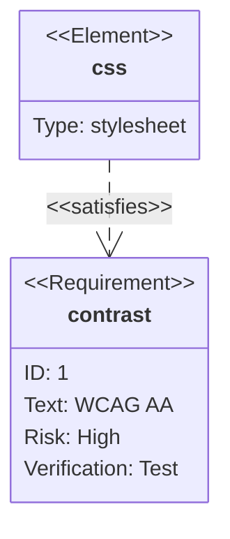
```mermaid
requirementDiagram
  requirement contrast {
    id: 1
    text: WCAG AA
    risk: high
    verifymethod: test
  }
  element css {
    type: stylesheet
  }
  css - satisfies -> contrast
```

## Block

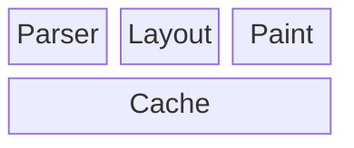
```mermaid
block-beta
  columns 3
  A["Parser"] B["Layout"] C["Paint"]
  D["Cache"]:3
```

## Sankey

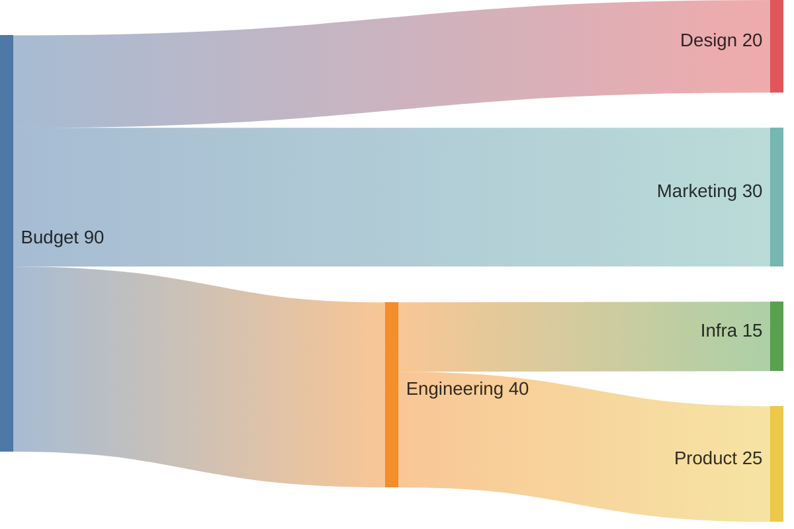
```mermaid
sankey-beta
Budget,Engineering,40
Budget,Design,20
Budget,Marketing,30
Engineering,Infra,15
Engineering,Product,25
```

## XY Chart

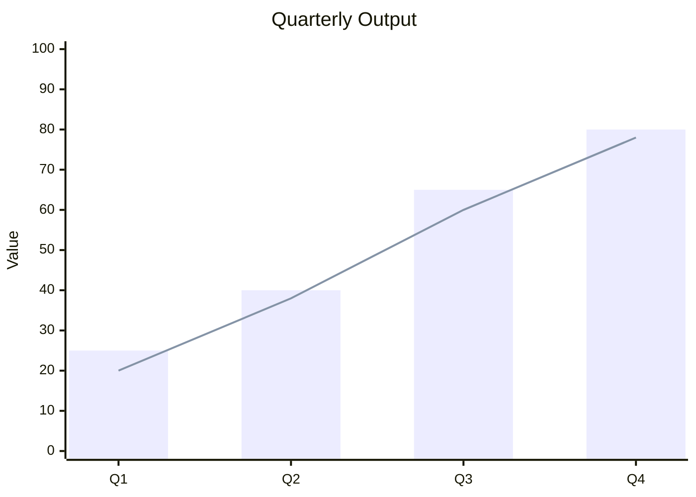
```mermaid
xychart-beta
    title "Quarterly Output"
    x-axis [Q1, Q2, Q3, Q4]
    y-axis "Value" 0 --> 100
    bar [25, 40, 65, 80]
    line [20, 38, 60, 78]
```

## Radar

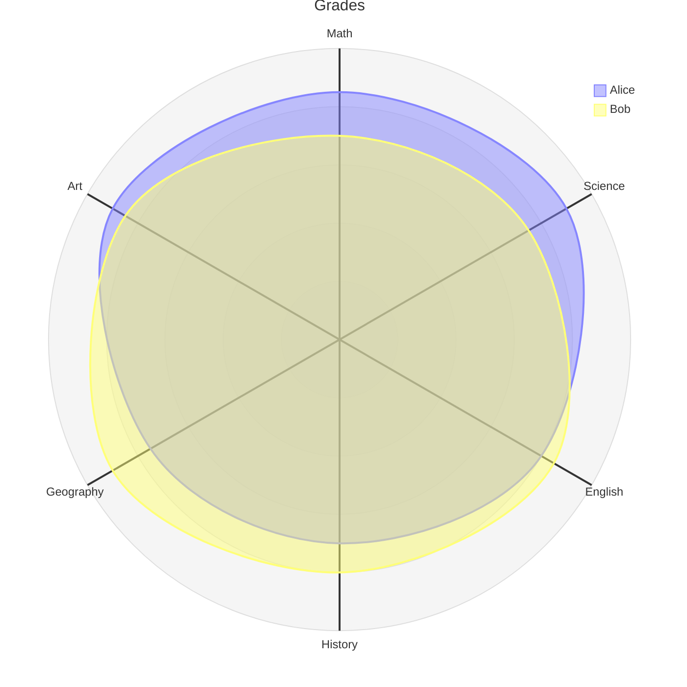
```mermaid
---
title: "Grades"
---
radar-beta
  axis m["Math"], s["Science"], e["English"]
  axis h["History"], g["Geography"], a["Art"]
  curve alice["Alice"]{85, 90, 80, 70, 75, 90}
  curve bob["Bob"]{70, 75, 85, 80, 90, 85}
  max 100
  min 0
```

## Treemap

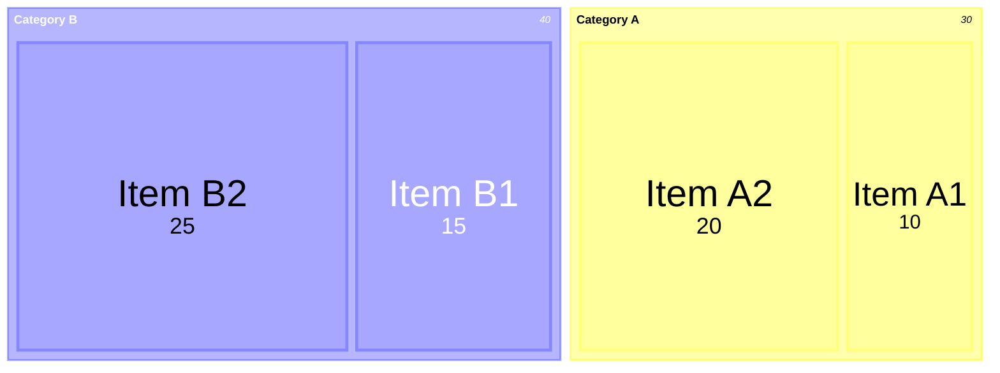
```mermaid
treemap-beta
"Category A"
    "Item A1": 10
    "Item A2": 20
"Category B"
    "Item B1": 15
    "Item B2": 25
```

## Packet

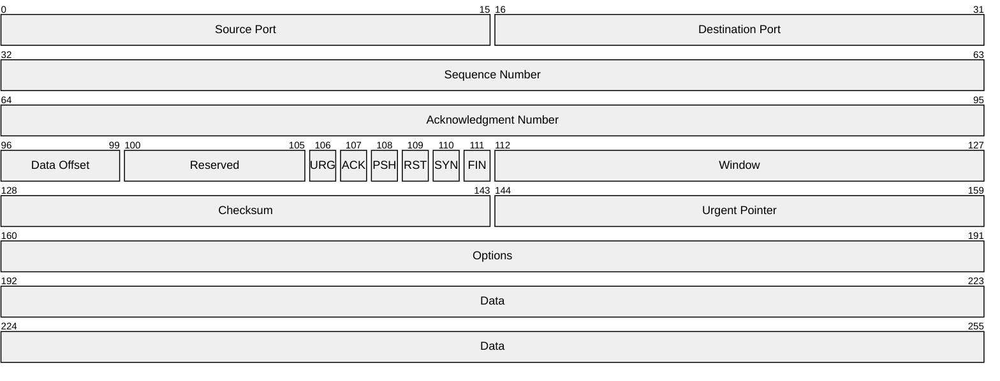
```mermaid
packet-beta
0-15: "Source Port"
16-31: "Destination Port"
32-63: "Sequence Number"
64-95: "Acknowledgment Number"
96-99: "Data Offset"
100-105: "Reserved"
106: "URG"
107: "ACK"
108: "PSH"
109: "RST"
110: "SYN"
111: "FIN"
112-127: "Window"
128-143: "Checksum"
144-159: "Urgent Pointer"
160-191: "Options"
192-255: "Data"
```

## Markdown Label Indentation

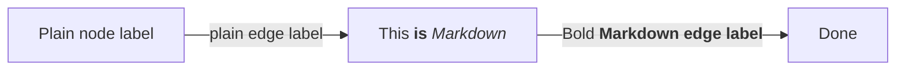
```mermaid
flowchart LR
  plain["Plain node label"]
  markdown["`This **is** _Markdown_`"]
  done["Done"]

  plain -- "plain edge label" --> markdown
  markdown -- "`Bold **Markdown edge label**`" --> done
```

## Kanban

```mermaid
kanban
  todo[Todo]
    docs[Write docs]
    review[Review theme selectors]
  progress[In Progress]
    fix[Patch Mermaid coverage]
  done[Done]
    audit[Audit Typora support]
```

## Architecture

```mermaid
architecture-beta
    group app(cloud)[Application]
    service web(server)[Web] in app
    service db(database)[Database] in app
    service disk1(disk)[Storage] in app
    web:R -- L:db
    db:B -- T:disk1
```

## Venn

```mermaid
venn-beta
title Render Check
set A["Writing"]:12
set B["Coding"]:10
union A,B["Shared"]:4
```

## Ishikawa

```mermaid
ishikawa-beta
  "Theme Mermaid gaps"
    "Old selector set"
      "No kanban-specific rules"
      "No packet-specific rules"
    "New Mermaid features"
      "Venn"
      "Ishikawa"
      "Radar"
```
